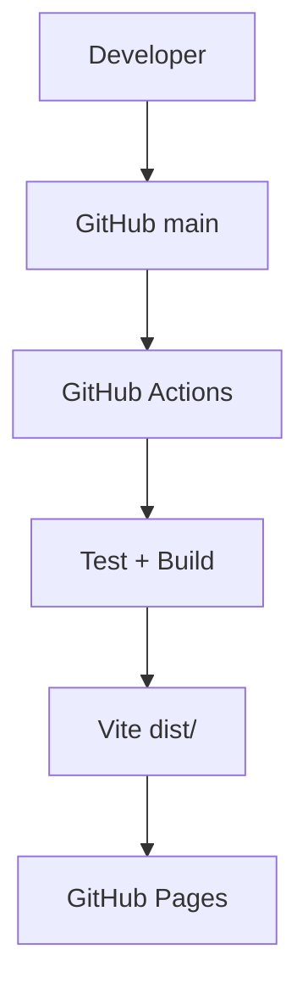

# Rob Bundy — Engineering Portfolio

Personal engineering portfolio for Rob Bundy, focused on backend systems, platform engineering, developer tooling, infrastructure, CI/CD, full-stack products, and product usability.

Live site: https://robbundy2002.github.io/Website/

## Overview

This site is a static React + TypeScript + Vite application deployed to GitHub Pages. It uses real routes for the homepage, project index, featured project case studies, experience, about, and contact pages.

## Featured Projects

- **Northstar** — Kubernetes operations platform for debugging, observability, RBAC-aware actions, Prometheus metrics, Docker, and Helm workflows.
- **CareerBoard** — Full-stack collaborative job-search workspace with Express, SQLite, team roles, activity, interviews, analytics, CI, and Docker.
- **UJLP** — Production publication platform for UVA's Undergraduate Journal of Law & Politics with structured content validation and GitHub Pages deployment.
- **ResumeGPT** — Privacy-first browser-only resume analyzer with local PDF/TXT parsing, deterministic skill matching, explainable scoring, and AI-ready prompt generation.

Additional applications, games, data projects, coursework, and research artifacts are included in the project portfolio with dedicated pages.

## Tech Stack

- React 18
- TypeScript
- Vite
- React Router
- Vitest
- React Testing Library
- Playwright
- ESLint
- Prettier
- GitHub Actions
- GitHub Pages

## Site Architecture

```text
src/data/projects.ts
        |
        |-- homepage cards
        |-- projects overview
        |-- project navigation
        |-- project metadata
        |
        v
React Router pages
        |
        v
Vite static build
```

## Project Pages

Required project routes:

- `/projects/northstar`
- `/projects/careerboard`
- `/projects/ujlp`
- `/projects/resumegpt`

Each case study uses shared project layout components while keeping project-specific problem, motivation, architecture, screenshots, testing, deployment, tradeoff, and status content.

## Local Development

```bash
npm ci
npm run dev
```

## Testing

```bash
npm run lint
npm run typecheck
npm run test:run
npm run build
npm run test:e2e
```

## CI/CD

`.github/workflows/ci.yml` runs on pushes to `main` and pull requests targeting `main`:

```text
npm ci
npm run lint
npm run typecheck
npm run test:run
npm run build
```

## Deployment

GitHub Pages deployment is handled by `.github/workflows/deploy.yml` using official Pages actions. The workflow builds Vite output into `dist/`, uploads the Pages artifact, and deploys from GitHub Actions.



Deep links use BrowserRouter with Vite base `/Website/` and a generated `404.html` redirect fallback for GitHub Pages refresh support.

## Accessibility

The site uses semantic landmarks, keyboard-accessible navigation, visible focus states, meaningful image alt text, sufficient contrast, reduced-motion handling, and automated route/component coverage.

## Project Structure

```text
src/
  components/
    layout/
    navigation/
    project/
    ui/
  data/
  layouts/
  pages/
    projects/
  styles/
  test/
tests/e2e/
public/
legacy-assets/
```

## License

No explicit license is currently declared for this repository.
